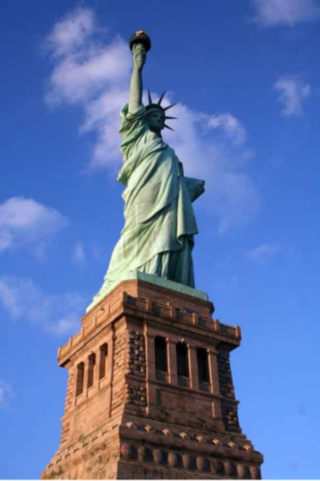
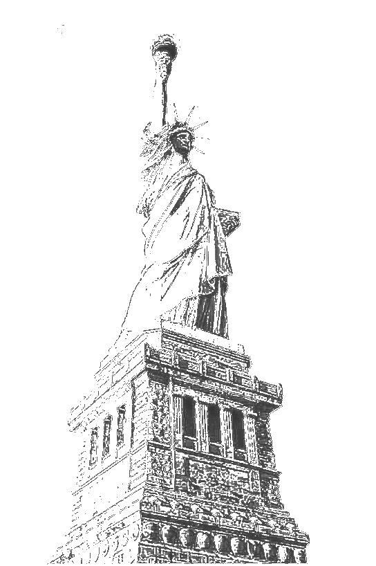
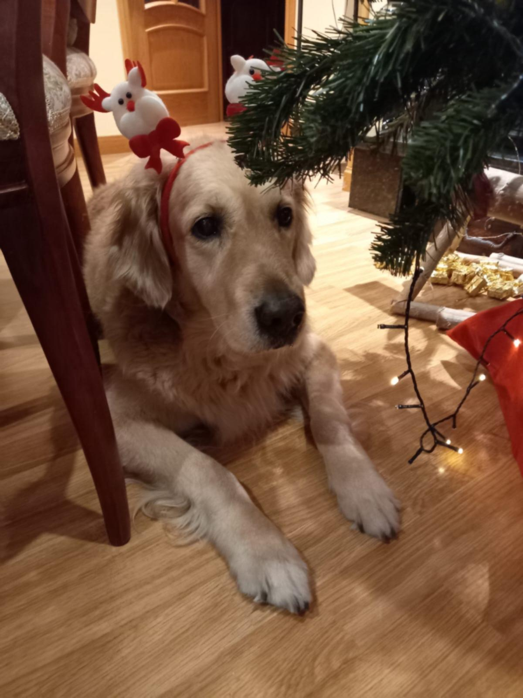
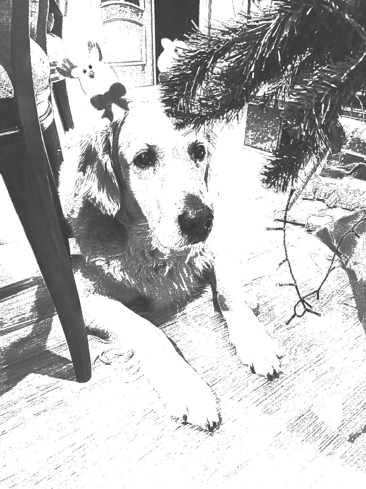
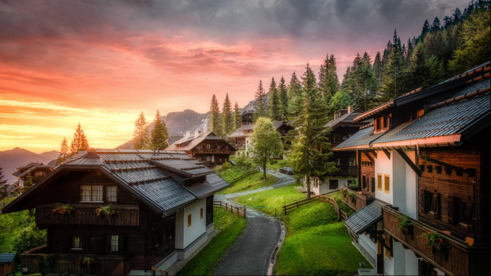

Filtrador Positronico
======

## 

------

## 

------

## Tareas pendientes

* Extraer metodos de filtrado en clases distintas
* Añadir a esas clases como atributos las imagenes que hayan procesado, para asi, en caso de que no se hayan modificado los parametros no se tenga que recalcular ese paso -> añadir cache para imágenes
* Usar herencia para poder mantener todos los pasos que se desean aplicar a una imagen en un array u otra estructura y asi poder añadir tantos filtros como se deseen en el orden que se deseen 
* Añadir interfaz gráfica con sliders para poder seleccionar los parámetros.
    * Definir rangos de valores posibles para cada parámetro.
    * Definir distribución de los valores en el slider (exponencial, lineal, ...).
    * Programar sliders.
* Añadir visualizacion de las imagenes en sus distintos pasos
* Añadir nombre del filtro aplicado al nombre de la imagen generada (`420-contour.jpg` por ejemplo)
* Mejorar sistema de cache para que no guarde las imágenes en la carpeta generatedImg.
* Detectar combinaciones de campos no válidas (evitar nullPointer exceptions) -> inhabilitar campos.

## Tareas realizadas
* Añadir selección de imágenes a traves del explorador de archivos.
* Escalar la imagen en función del tamaño de la ventana.
* Guardar imagen editada.

------

## Resultados

------

| Imagen        | variance      | variance_scalar   |  radius   | threshold | p     | phi   |
| ------------- |:-------------:| :-------------:   | :-----:   | :------:  |:-----:|:----: |
| Libertad        | 0.6           |1.6                |10         | 66.3      |  16    |  0.01    |
| Nymeria         | 0.6           |   1.6             |   10      |   66.3    |  16    |  0.01   |
| Montaña       | 0.6           |    1.6            |   10      |   66.3    |  16    |  0.01    |
| Montaña2       | 0.6           |    1.6            |   10      |   200    |  21    |  0.04    |

* ### Libertad

<kbd></kbd><kbd></kbd>

* ### Nymeria
<kbd></kbd><kbd></kbd>

* ### Montaña
<kbd></kbd><kbd></kbd>
* ### Montaña2
<kbd></kbd><kbd></kbd>
 

## Referencias

------

* [**XDoG: An eXtended difference-of-Gaussians compendium
including advanced image stylization**](https://users.cs.northwestern.edu/~sco590/winnemoeller-cag2012.pdf)  

* [**Video explicactivo de las DoG**](https://www.youtube.com/watch?v=5EuYKEvugLU&ab_channel=Acerola)

